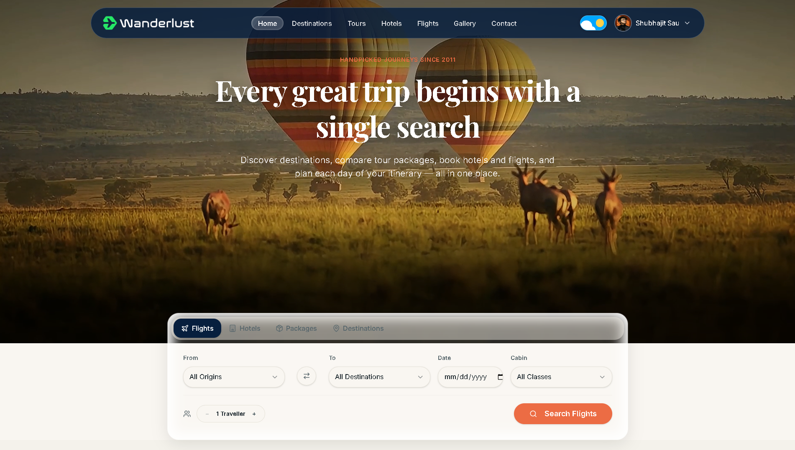
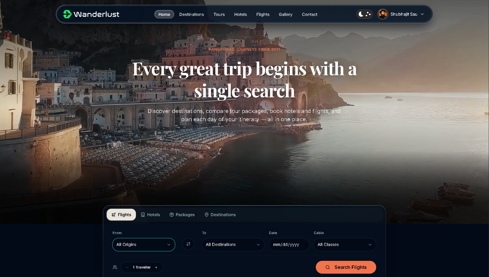
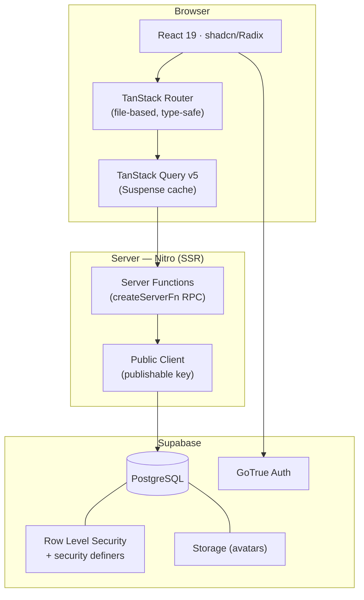

<div align="center">

  

# 🌍 Wanderlust

### Full-Stack Travel Booking & Trip Planning Platform

*Cinematic travel discovery — destinations, tours, hotels, flights, itineraries, and a complete admin panel — in one seamless experience.*

[](https://react.dev)
[](https://tanstack.com/start)
[](https://www.typescriptlang.org/)
[](https://tailwindcss.com/)
[](https://supabase.com/)
[](https://ui.shadcn.com/)

[](https://your-deployed-url.vercel.app)
[](LICENSE)

</div>

---

<div align="center">
  
  
  <br/>
  <em>Light & Dark themes — full-bleed video hero, glassmorphic tabbed search, animated theme toggle (View Transitions API)</em>
</div>

---

## ✨ What It Does

Wanderlust is a complete travel booking platform — **24 destinations** (international + India), tour packages, hotels, and flights — with real bookings, trip planning, moderated reviews, and a[...]

| 🗺️ Discovery | 🏨 Booking | 🧳 Planning | ⚙️ Management |
|---|---|---|---|
| SSR destination & package catalogs with URL-synced search, filters & pagination | Multi-step checkout for **tours, hotels & flights** — multi-guest, live price math, booking references | Day-b[...] 
| Photo gallery with keyboard-navigable lightbox | Auth-gated booking flow with deep-link redirects | User dashboard: trips, itineraries, reviews, profile + avatar | Role-based access via `is_admi[...]
| Reviews with star distribution & moderation workflow | Simulated payment (demo mode, clearly labeled) | Review system with approval gating | Real-time stats & 30-day booking charts |

## 🏗️ Architecture



**Key engineering decisions:**

- 🖥️ **SSR-first for public pages** — catalog data is prefetched in route loaders via `ensureQueryData` + `useSuspenseQuery`, so the initial HTML ships with content (SEO + zero layout shift[...]
- 🔐 **Security at the database layer** — every table is RLS-protected with role checks via PostgreSQL security-definer functions (`is_admin()`, `has_role()`). Client-side guards are UX only; [...]
- 🎨 **Design-token discipline** — the entire UI (including dual light/dark themes and glass materials) is driven by centralized **OKLCH CSS custom properties**; zero hard-coded colors in comp[...]
- 🎬 **Apple-style motion system** — critically-damped springs (`motion`), View Transitions API theme reveal, staggered scroll reveals — all with `prefers-reduced-motion` fallbacks.

## 🛠️ Tech Stack

| Layer | Technology | Why |
|---|---|---|
| Framework | **TanStack Start** (React 19 + Vite + Nitro) | SSR, streaming, type-safe RPC |
| Routing | **TanStack Router** | File-based, fully typed search params (shareable filter URLs) |
| Data | **TanStack Query v5** | Suspense-ready caching, optimistic mutations |
| Styling | **Tailwind CSS v4** | OKLCH token system, `@theme` design variables |
| UI | **shadcn/ui + Radix** | Accessible primitives (40+ components) |
| Backend | **Supabase** | Postgres, Row Level Security, Auth, Storage |
| Validation | **Zod** + react-hook-form | Every form, both client & flow gates |
| Animation | **motion** (motion.dev) | Interruptible, velocity-aware springs |
| Icons / Toasts | **lucide-react** / **sonner** | — |

## 🗄️ Database (12 tables, RLS-enforced)

`profiles` · `user_roles` · `destinations` · `tour_packages` · `hotels` · `flights` · `bookings` · `itineraries` · `itinerary_items` · `reviews` · `gallery_images` · `contact_messages`

Every table enforces authorization at the row level — e.g. users CRUD only their own bookings/itineraries/reviews, catalog reads are public but writes are admin-only, and reviews are publicly vi[...]

## 📁 Project Structure

```
wanderlust-codebase/
├── src/
│   ├── routes/            # File-based routes (public SSR / client /account /admin)
│   ├── components/
│   │   ├── ui/            # shadcn/Radix primitives
│   │   ├── home/          # Hero, SearchWidget, sections
│   │   ├── shared/        # Cards, ReviewSection, BookingCTA...
│   │   ├── vendored/      # Ported registry components (toggled, adapted)
│   │   └── admin/         # DataTable, EntityForm, dashboards
│   ├── lib/               # Server functions (SSR data layer), guards, utils
│   ├── hooks/             # use-auth (session/role context)
│   │   └── integrations/      # Supabase clients + generated DB types
├── docs/                  # PRD, architecture, design system, memory
└── drizzle/               # Schema & migrations
```

## 🚀 Run It Locally

```bash
git clone https://github.com/huzz-bitcrafter/wanderlust-travel.git
cd "wanderlust-travel/Travel Booking Site/wanderlust-codebase"

npm install

# Configure your own Supabase project
cp .env.example .env    # add SUPABASE_URL + SUPABASE_PUBLISHABLE_KEY

npm run dev             # → http://localhost:8080
```

> The schema lives in `drizzle/migrations/` — run it in your Supabase SQL Editor to stand up all tables, RLS policies, and the signup trigger.

## 🧪 Verified

- ✅ TypeScript strict — zero `any`
- ✅ ESLint clean, production build green
- ✅ WCAG 2.1 AA/AAA contrast — both themes (measured, not assumed)
- ✅ SSR content verified in raw HTML across public routes
- ✅ RLS cross-account access tests (user A cannot read user B's data — enforced at DB level)
- ✅ `prefers-reduced-motion` respected by every effect

## 🤝 Credits

Built as a solo full-stack project with an AI-assisted, spec-driven workflow — 14 documented phases, full PRD/architecture/design-system docs in [`docs/`](docs/), and a git history that tells t[...]

<div align="center">

**[huzz-bitcrafter](https://github.com/huzz-bitcrafter)**

</div>
