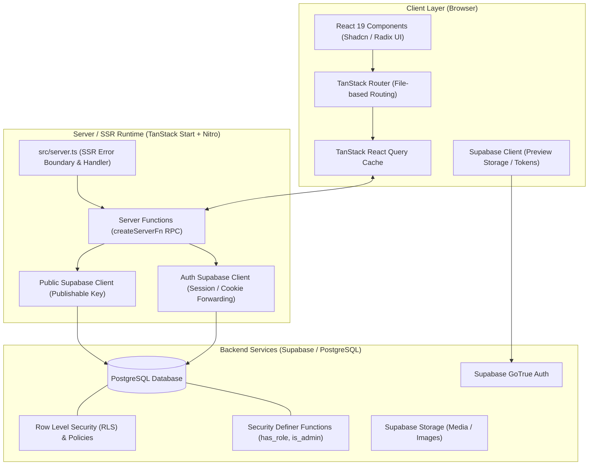
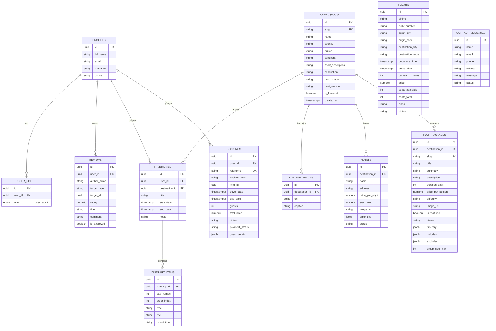

# Architecture — Wanderlust Travel Booking & Trip Planner

## 1. System Overview

**Wanderlust** is a modern, high-performance, full-stack travel booking and itinerary planning platform. Built on **TanStack Start** (React 19 + Vite + Nitro) and powered by **Supabase** (PostgreSQL + Auth + RLS), the platform provides server-side rendering (SSR) for SEO-critical catalog pages, type-safe RPC server functions, and an accessible design system tailored for travel discovery.

---

## 2. High-Level Architecture Diagram



---

## 3. Technology Stack

| Layer             | Technology                                                      | Purpose                                                                         |
| :---------------- | :-------------------------------------------------------------- | :------------------------------------------------------------------------------ |
| **Framework**     | [TanStack Start](https://tanstack.com/start) (`v1.168+`)        | Full-stack React 19 framework with SSR, Nitro server engine, and hydration      |
| **Routing**       | [TanStack Router](https://tanstack.com/router) (`v1.170+`)      | Fully type-safe, file-based routing with search-param validation and loaders    |
| **State & Cache** | [TanStack Query](https://tanstack.com/query) (`v5.101+`)        | Asynchronous server-state management, cache deduplication, and Suspense support |
| **UI & Styling**  | [Tailwind CSS v4](https://tailwindcss.com/) + OKLCH Tokens      | Utility-first styling with modern color gamut support and animation presets     |
| **Component Kit** | [Radix UI](https://www.radix-ui.com/) + Shadcn UI               | Accessible, composable primitive components (Dialogs, Menus, Accordions, Forms) |
| **Icons & Fonts** | [Lucide React](https://lucide.dev/) + Playfair Display & Inter  | Editorial display typography and lightweight iconography                        |
| **Backend & DB**  | [Supabase](https://supabase.com/) (PostgreSQL `14.5`)           | Relational database, PostgREST API, RLS security, and auth                      |
| **Build Tooling** | [Vite 8](https://vitejs.dev/) + [Nitro](https://nitro.unjs.io/) | Fast HMR dev server and portable production server bundle                       |

---

## 4. Directory Structure

```
wanderlust-codebase/
├── drizzle/                      # Drizzle ORM schema & migrations
│   ├── migrations/
│   └── schema.ts
├── public/                       # Static public assets (favicon, images)
├── src/
│   ├── components/
│   │   ├── home/                 # Home page section components
│   │   │   ├── CtaBand.tsx
│   │   │   ├── FeaturedDestinations.tsx
│   │   │   ├── FeaturedPackages.tsx
│   │   │   ├── Hero.tsx
│   │   │   ├── Testimonials.tsx
│   │   │   └── WhyUs.tsx
│   │   ├── layout/               # Global layout & structural wrappers
│   │   │   ├── Footer.tsx
│   │   │   ├── Navbar.tsx
│   │   │   └── SiteLayout.tsx
│   │   ├── shared/               # Reusable business UI widgets
│   │   │   ├── ComingSoon.tsx
│   │   │   └── Rating.tsx
│   │   └── ui/                   # 40+ Radix/Shadcn UI primitive components
│   │       ├── button.tsx, card.tsx, dialog.tsx, select.tsx, etc.
│   │
│   ├── hooks/                    # Custom React client hooks
│   ├── integrations/
│   │   └── supabase/             # Supabase client instances, auth wrappers & DB types
│   │       ├── auth-attacher.ts
│   │       ├── auth-middleware.ts
│   │       ├── client.server.ts
│   │       ├── client.ts
│   │       ├── previewAuthStorage.ts
│   │       └── types.ts          # Auto-generated database schema TypeScript definitions
│   │
│   ├── lib/                      # Core helpers & Server Functions
│   │   ├── catalog.functions.ts  # createServerFn for SSR prefetching (Destinations/Tours)
│   │   ├── error-capture.ts      # Unhandled SSR error interceptor
│   │   ├── error-page.ts         # Catastrophic SSR HTML fallback template
│   │   ├── home-content.ts       # Static home data (testimonials, values)
│   │   ├── lovable-error-reporting.ts
│   │   ├── supabase-public.server.ts # Server-side publishable key Supabase instance
│   │   └── utils.ts              # Classnames merging (clsx + tailwind-merge)
│   │
│   ├── routes/                   # File-based routing tree (TanStack Router)
│   │   ├── __root.tsx            # App shell with HTML metadata, font links & Toaster
│   │   ├── index.tsx             # Home landing route with prefetching loader
│   │   ├── destinations.tsx      # Destinations listing & search route
│   │   ├── packages.tsx          # Tour packages route
│   │   ├── hotels.tsx            # Hotels catalog route
│   │   ├── flights.tsx           # Flights booking route
│   │   ├── gallery.tsx           # Photo gallery route
│   │   ├── contact.tsx           # Contact form route
│   │   ├── login.tsx             # User authentication login
│   │   └── register.tsx          # User registration route
│   │
│   ├── routeTree.gen.ts          # Auto-generated TanStack route hierarchy
│   ├── router.tsx                # createRouter factory with QueryClient context
│   ├── server.ts                 # Nitro server entry & SSR response normalizer
│   ├── start.ts                  # TanStack Start client bootstrap
│   └── styles.css                # Global Tailwind v4 design tokens & base layers
│
├── package.json                  # Dependencies and run scripts
├── tsconfig.json                 # TypeScript compiler paths & settings
└── vite.config.ts                # Vite & TanStack Start bundling config
```

---

## 5. Database & Entity Relationship Model

The Supabase database model enforces strict relational constraints, isolation through **Row Level Security (RLS)**, and role-based permissions via a dedicated `user_roles` table.



---

## 6. Key Architecture Patterns

### A. SSR Catalog Prefetching & Hydration

- Public catalog data (featured destinations, tour packages) is fetched server-side via `createServerFn` (`src/lib/catalog.functions.ts`).
- In route loaders (e.g., `src/routes/index.tsx`), `ensureQueryData` primes the `QueryClient` cache during SSR.
- Components use `useSuspenseQuery` for instantaneous rendering without layout shifts or client waterfall requests.

### B. Dual Supabase Client Isolation

- **Public Server Client** (`src/lib/supabase-public.server.ts`): Lightweight, stateless client utilizing the publishable key for public, cached reads (destinations, packages, hotels) during SSR without cookie overhead.
- **Client & Session Client** (`src/integrations/supabase/client.ts`): Handles user authentication, token auto-refresh, and authenticated mutations (bookings, reviews, custom itineraries) respecting RLS.

### C. Security & Authorization Model

- **Row Level Security (RLS)** is enabled on all tables in Supabase.
- User roles are decoupled from the public `profiles` table and stored in `user_roles`.
- Role checks run through PostgreSQL security-definer helper functions:
  - `has_role(_role, _user_id)`
  - `is_admin()`

### D. Design System & Design Tokens

Defined in `src/styles.css` with **OKLCH** color values:

- **Primary**: Deep Navy-Teal (`oklch(0.3 0.062 250)`)
- **Secondary**: Marine Teal (`oklch(0.62 0.096 186)`)
- **Accent**: Warm Coral (`oklch(0.676 0.146 40)`)
- **Background**: Soft Warm Off-White (`oklch(0.975 0.008 85)`)
- **Typography**: `Playfair Display` for headlines, `Inter` for interface and reading copy.

---

## 7. Current Project Status & Phased Roadmap

|     Phase      | Module                  |  Status   | Description                                                                    |
| :------------: | :---------------------- | :-------: | :----------------------------------------------------------------------------- |
| **Foundation** | Backend & Database      | Completed | Supabase tables, RLS policies, seed data & security definers created           |
|  **Phase 1**   | Design System & Tokens  | Completed | OKLCH tokens, Google Fonts, Radix UI components, shadow utilities              |
|  **Phase 2**   | Layout & Home Page      | Completed | Navbar (mobile drawer), Footer, Hero search, Featured cards, Testimonials, CTA |
|  **Phase 3**   | Destinations            |  Planned  | Destinations catalog, search/filter bar, continent tabs, slug detail page      |
|  **Phase 4**   | Authentication          |  Planned  | `/login`, `/register`, password recovery, auth state listeners in Navbar       |
|  **Phase 5**   | Tour Packages           |  Planned  | Packages catalog, day-by-day itinerary accordions, pricing breakdown           |
|  **Phase 6**   | Hotels & Accommodations |  Planned  | Hotel search, star ratings, amenity filters, room booking cards                |
|  **Phase 7**   | Flight Search           |  Planned  | Direct & connecting flight search, airline filters, seat class selection       |
|  **Phase 8**   | Itinerary Builder       |  Planned  | User custom day-by-day trip builder (`itineraries` + `itinerary_items`)        |
|  **Phase 9**   | Reviews & Ratings       |  Planned  | Customer review submission, moderation approval, rating aggregates             |
|  **Phase 10**  | Bookings & Checkout     |  Planned  | Multi-step booking checkout flow, reference generation, booking receipts       |
|  **Phase 11**  | User Dashboard          |  Planned  | Trips history, active bookings status, saved itineraries, profile editor       |
|  **Phase 12**  | Admin Management        |  Planned  | Admin route guarding (`is_admin`), destination/package CRUD, review moderation |
|  **Phase 13**  | Gallery & Contact Us    |  Planned  | Photo gallery lightbox view and contact inquiry message submission             |
|  **Phase 14**  | QA & Polish             |  Planned  | Responsive audit, skeletons/empty/error states, performance & SEO audit        |
